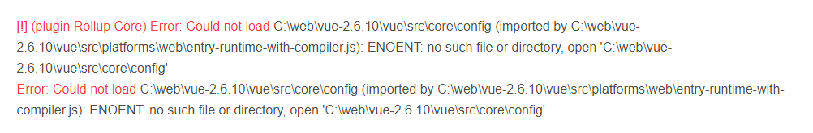

# 调试源码

之前的步骤都是直接看代码来找入口的，我们如何在浏览器中对 Vue 源码进行调试，进而更明显的看到代码执行过程呢？

首先从[这里](https://github.com/vuejs/vue.git)下载最新的 Vue2 代码，执行`git clone`将代码拉到本地，然后`npm install`安装依赖。

接着我们需要修改一下 script 指令，因为原本`npm run dev`这一个指令打包出来的代码是压缩过的不带 sourceMap 的版本，不易阅读，因此我们修改一下指令：

`"dev": "rollup -w -c scripts/config.js --sourcemap --environment TARGET:web-full-dev"`

主要是加上了--sourcemap 这一个参数。

接着执行`npm run dev`，在编译过程中可能会报这个错误：

这个错误引发的原因是 rollup-plugin-alias 对 windows 的兼容不好，解决方法：

- 下载https://github.com/ideayuye/rollup-plugin-alias并覆盖掉本地文件夹 \node_modules\rollup-plugin-alias
- 进入 rollup-plugin-alias 文件夹，依次执行 npm i ,npm run build.
- 重新启动 vue 项目。

接着我们在 Vue 源码目录下的 examples 里面可以新建一个 `test.html`，里面就可以写我们的代码然后进行调试了。

总结一下：

- 拉 Vue 源码
- scripts 的 dev 指令加上--sourcemap
- 有错误的话修改错误
- 执行 npm run dev
- 开始调试
